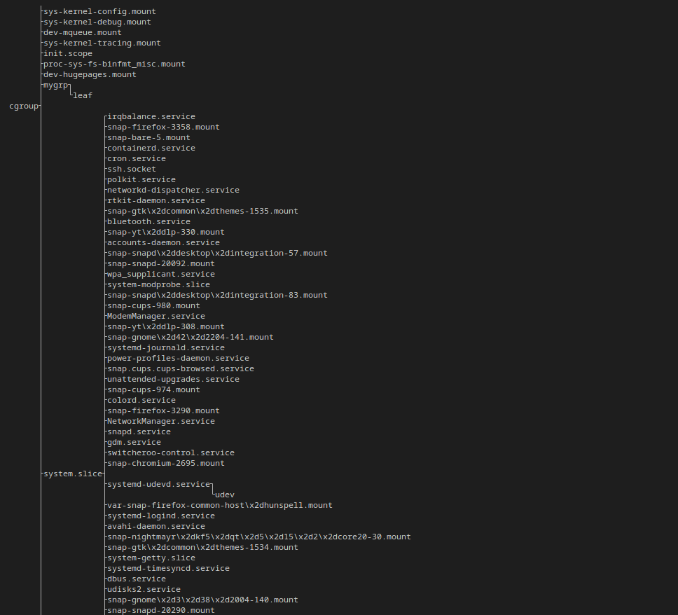

# dolos
dolos is a very small tool for displaying the cgroup hierarchy.

You can install dolos directly from GitHub with `pip install git+https://github.com/eu90h/dolos`.

Usage is simple: execute `dolos` to pretty-print the `/sys/fs/cgroup` directory. If your cgroup dir is mounted somewhere else, try `dolos --root PATH_TO_ROOT_CGROUP`.

The output will look something like 
